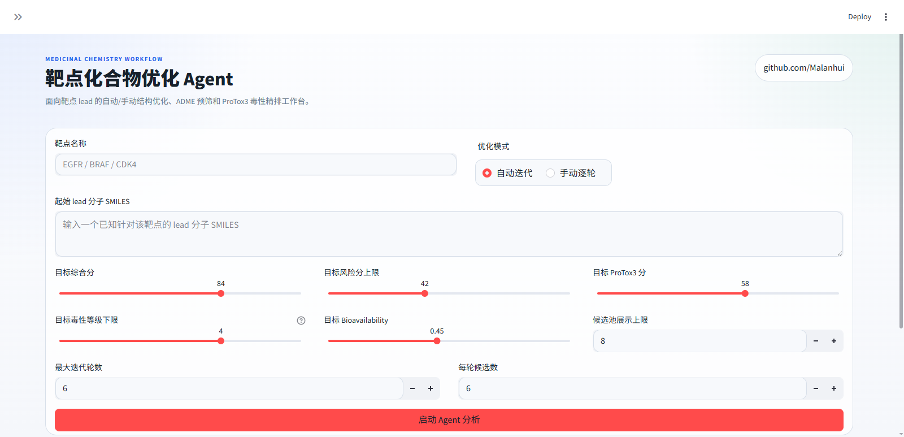
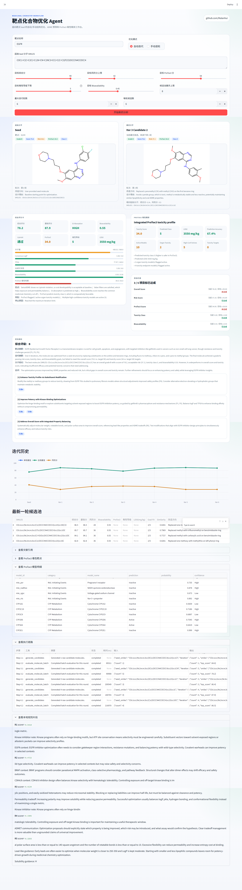

# Pharma Target Agent


基于 LangChain ReAct + FAISS RAG + RDKit + SwissADME + ProTox3 的药物化学 lead 优化 Agent。

给定靶点名称和起始 SMILES，系统会检索 PubMed 和本地药化规则库，让大模型在保留核心 scaffold 的前提下生成候选分子，经多参数评估后输出排序结果，并支持自动迭代或手动逐轮优化。



---

## 功能

- 多轮 lead optimization，每轮基于上一轮最优分子继续生成
- 多目标约束框架：同时考虑 ADME、药化风险、毒性和口服开发性
- 自动模式：持续迭代直到满足目标或达到最大轮数
- 手动模式：每轮候选池由用户指定下一轮种子分子，适合人工控制 SAR 方向
- 外部服务（SwissADME / ProTox3）做了缓存、节流、重试和回退处理

---

## 评分体系

系统使用五个目标参数做多目标约束，不是简单地按综合分排序。

| 参数 | 方向 | 作用 |
|---|---|---|
| 目标综合分 | 越高越好 | 全局质量指标，覆盖 ADME、药化规则、QED 和毒性修正 |
| 目标风险分上限 | 越低越好 | 约束药化和安全性负担，防止系统追高分却选出"脏"分子 |
| 目标 ProTox3 分 | 越高越好 | 整合毒性档案（毒性等级、LD50、active model 数量等）成连续值 |
| 目标 Bioavailability | 越高越好 | 对应 SwissADME 的 Bioavailability Score，约束口服开发性 |
| 目标毒性等级下限 | 越高越好 | 对应 ProTox3 的 Toxicity Class（Class 1 最毒，Class 6 最安全），作为硬阈值 |

**候选排序逻辑：**

1. 是否满足全部已启用目标
2. 满足了多少个目标
3. 综合分
4. 风险分
5. ProTox3 分和相似性

一个综合分略低但更安全、更满足目标的分子，会排在前面。

### 参数推荐

**偏探索（早期发散）**

```
目标综合分：78–84　　目标风险分上限：45–55
目标 ProTox3 分：50–60　　目标 Bioavailability：0.40–0.55
目标毒性等级下限：3–4
```

**偏收敛（向 pre-candidate 靠拢）**

```
目标综合分：84–90　　目标风险分上限：30–42
目标 ProTox3 分：58–72　　目标 Bioavailability：0.55–0.70
目标毒性等级下限：4–5
```

---

## 项目结构

```
Playground/
├─ README.md
├─ requirements.txt
├─ start_app.ps1
├─ .env
├─ .env.example
└─ pharma_agent/
   ├─ config.py
   ├─ agent/
   │  ├─ core.py
   │  ├─ memory.py
   │  └─ tools.py
   ├─ data/
   │  ├─ drug_rules.txt
   │  ├─ swissadme_cache.json
   │  ├─ protox3_cache.json
   │  └─ faiss_index/
   │     ├─ index.faiss
   │     └─ metadata.json
   ├─ mol/
   │  ├─ evaluator.py
   │  ├─ swissadme_client.py
   │  └─ protox3_client.py
   ├─ rag/
   │  ├─ build_index.py
   │  ├─ embeddings.py
   │  └─ retriever.py
   └─ ui/
      └─ app.py
```

---

## 安装

需要 Python 3.10 或 3.11。

```powershell
py -3.11 -m venv .venv
.venv\Scripts\activate
python -m pip install --upgrade pip
pip install -r requirements.txt
copy .env.example .env
```

---

## 配置

编辑 `.env`，最少需要配置候选生成 API：

```env
DEEPSEEK_API_KEY=your_key
DEEPSEEK_BASE_URL=https://api.deepseek.com
DEEPSEEK_MODEL=deepseek-chat
```

其他可选项：

```env
PUBMED_EMAIL=
PUBMED_TOOL=pharma-agent-demo
LOCAL_EMBEDDING_MODE=hash

SWISSADME_TIMEOUT=90
SWISSADME_CACHE_ENABLED=true
SWISSADME_DELAY_SECONDS=3.0        # 请求节流间隔（秒）

PROTOX3_TIMEOUT=120
PROTOX3_CACHE_ENABLED=true
PROTOX3_DELAY_SECONDS=6.0          # 请求节流间隔（秒）
PROTOX3_REFINE_TOP_N=2             # 每轮只对基础预筛前 N 名做 ProTox3 精排
PROTOX3_MAX_RETRIES=3
PROTOX3_RETRY_BACKOFF_SECONDS=8.0
```

---

## 构建本地 RAG 索引

```powershell
python -m pharma_agent.rag.build_index
```

---

## 启动

```powershell
.\start_app.ps1
```

或直接：

```powershell
python -m streamlit run .\pharma_agent\ui\app.py
```

---

## 使用流程

1. 输入靶点名称
2. 输入起始 lead 的 SMILES
3. 选择优化模式（自动 / 手动）
4. 设定目标参数和迭代轮数
5. 点击「启动 Agent 分析」

结果页包含：起始分子与最优分子的结构对比、评分卡、候选池、迭代历史曲线、ProTox3 模型明细、文献与规则引用、执行链路。

---

## 评分数据来源

**SwissADME** — GI absorption、Bioavailability score、Lipinski / Veber / Ghose / Egan / Muegge、PAINS / Brenk / Leadlikeness、合成可及性、CYP 抑制、P-gp

**RDKit** — 结构合法性、理化性质补充、Bemis-Murcko scaffold、指纹相似性、QED、结构渲染

**ProTox3** — Toxicity Class、LD50、active toxicity model 数、organ toxicity active 数、toxicity target binding

---

## ProTox3 稳定性

ProTox3 容易触发风控或短暂失效，项目做了以下处理：本地缓存、请求节流、失败重试与退避、每轮只对前 N 名做精排。如果一轮精排全部失败，会对关键候选做一次保底重试；如果 ProTox3 完全不可用，系统回退到非毒性精排流程，不会整轮中断。

---

## 限制

- 评分基于早期药化筛选经验，不是实验结论
- SwissADME 和 ProTox3 为外部服务，稳定性受网络和站点状态影响
- 大模型生成的候选结构仍需人工核查
- 高综合分不等于真实活性强，也不代表体内 PK 或毒性理想

---

---
## 结果展示

---

## 致谢

**SwissADME** — Daina A, Michielin O, Zoete V. *SwissADME: a free web tool to evaluate pharmacokinetics, drug-likeness and medicinal chemistry friendliness of small molecules.* Scientific Reports, 2017. [swissadme.ch](http://www.swissadme.ch)

**ProTox 3.0** — Banerjee P, et al. *ProTox-3.0: a webserver for the prediction of toxicity of chemicals.* Nucleic Acids Research, 2024. [tox.charite.de/protox3](https://tox.charite.de/protox3)

**RDKit** — Open-source cheminformatics toolkit. [rdkit.org](https://www.rdkit.org)

---

## License

[Apache License 2.0](./LICENSE)

本项目调用 SwissADME 和 ProTox3 作为外部 web 服务，预测结果受其各自服务条款约束，仅供研究参考，不构成任何临床或监管用途的依据。
